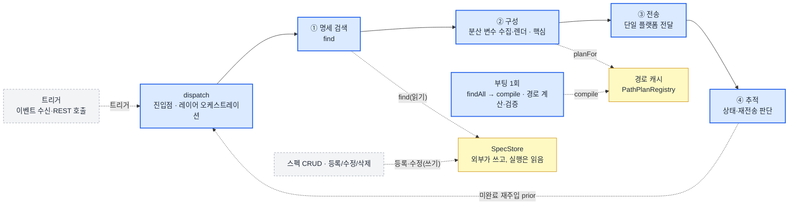
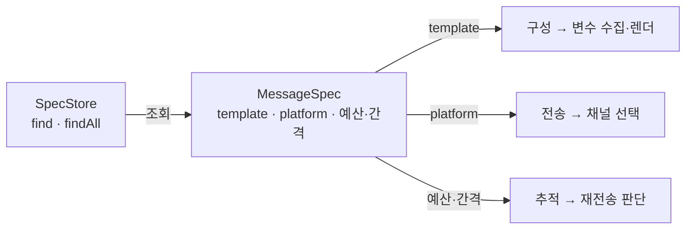
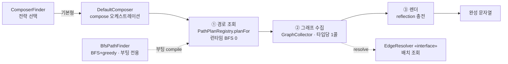
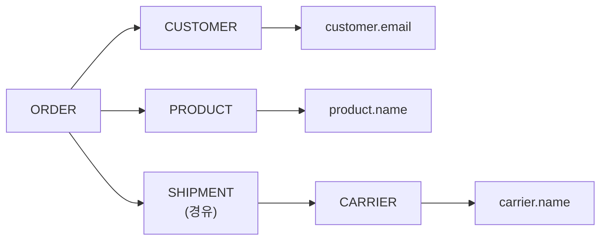
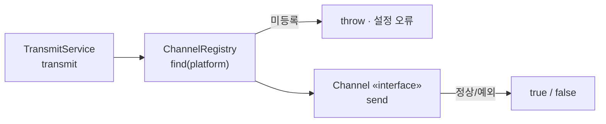
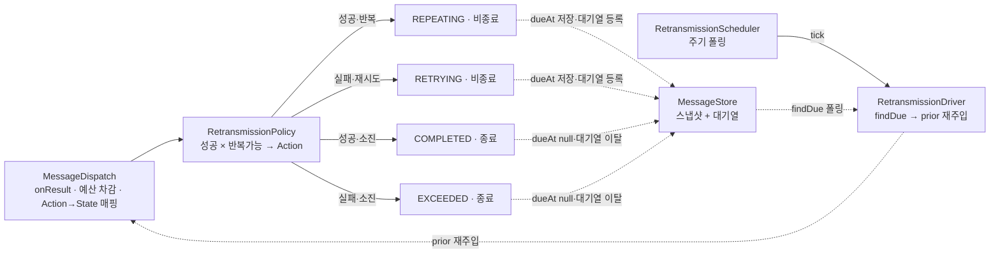
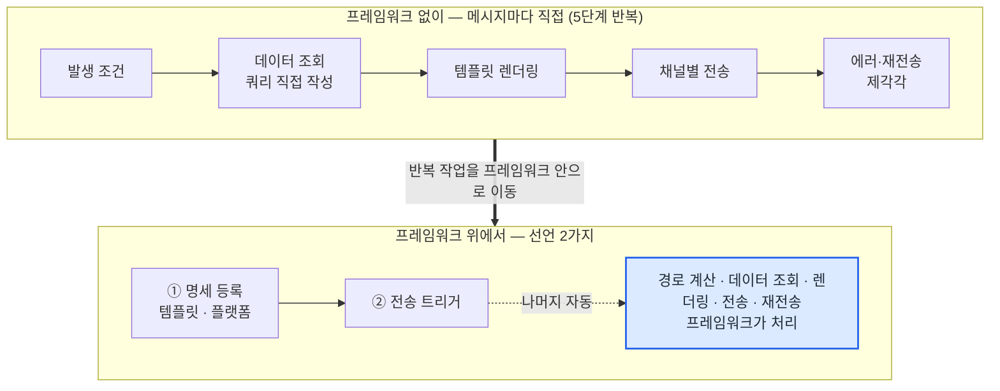

# 통합 메시징 프레임워크

> 메시지가 늘어도 추가 개발 비용이 거의 늘지 않도록 만든 멀티채널(Slack·Email·푸시) 메시징 서비스. 단독 기획·설계·구현.
>
> "주문 완료" 메일 하나에도 고객 이메일·상품명·배송사 이름 — 세 도메인에 흩어진 데이터가 필요. 이 수집 코드를 메시지마다 새로 짜는 대신, 도메인 관계를 그래프 한 벌로 모델링해 두면 프레임워크가 그 관계를 따라 **필요한 값을 찾아와 본문을 완성.** 새 메시지는 템플릿에 변수를 선언하는 것이 전부.

## ① 맥락 / 문제

**메시지 개발 비용이 선형으로 계속 늘어나는 구조**

* **환경** — 여러 팀이 각자 운영하는 사내 프로덕트에서, 회원가입·결제·작업 알림 같은 아웃바운드 메시지가 여러 마이크로서비스에 분산. 각 팀의 구현은 자기 서비스 안에서는 합리적이었지만, 공통 규칙이 없어 팀마다 그때그때 만든 코드가 적체.
* **반복 비용** — 새 메시지를 하나 추가할 때마다 발생 조건 판단, 흩어진 데이터 수집, 템플릿 치환, 채널 전송, 에러·재전송 처리를 처음부터 재구현.

  * 대부분 메시지마다 같은 로직인데 서비스별로 중복 구현.
  * 메시지·채널 매핑 명세가 없어, 비슷한 메시지를 추가하려면 기존 코드 역추적이 필요.
  * 특히 한 메시지가 여러 도메인(주문→고객·상품·배송 등)에 걸친 변수를 필요로 해, 그 분산 데이터 **수집 로직을 메시지마다 새로 작성** — 반복 비용의 가장 큰 몫.
* **목표** — 명세·구성·전송·추적을 한 프레임워크로 통합해, 새 메시지 추가의 반복 작업을 구조적으로 제거.

## ② 설계 / 구현

**설계의 두 축:**

* **레이어 분리** — 메시지 처리를 명세 → 구성 → 전송 → 추적 네 레이어로 분리. 레이어마다 책임을 응집하고, 기본 동작에 override를 열어 특수 케이스를 흡수.
* **분산 변수 수집** — 메시지마다 손으로 짜던 조회 쿼리를, 공통 그래프와 경로 계산이 만드는 자동 쿼리로 대체.

### ②-1 레이어

진입점 `dispatch`가 네 레이어를 순서대로 오케스트레이션:

* **명세** ②-1-1 — 메시지 정의를 한 객체로 읽음
* **구성** ②-1-2 — 분산 변수를 수집해 본문 완성 (핵심)
* **전송** ②-1-3 — 명세가 지정한 채널로 전달
* **추적** ②-1-4 — 결과로 상태 전이·재전송 판단

**다이어그램 = `dispatch`가 ①~④를 관통하는 실행 흐름.**

#### ②-1-1 명세

"주문 완료" 메일 한 건의 여정은 명세에서 시작.

* **역할** — 메시지 한 건의 정의를 `MessageSpec` 한 객체에 담음. 이후 모든 레이어가 이 객체만 읽고 동작.
* **단일 명세 근거**
  * **정의 소재지 일원화** — 한 메시지의 정의가 흩어지지 않고 한 객체에 모이므로, 찾고 고칠 곳이 하나로 고정.
  * **데이터 주도 소비** — 새 메시지가 코드가 아니라 명세 값으로 추가되므로, 레이어는 분기 없이 값만 읽음.
* **MessageSpec이 담는 것** — 각 레이어가 자기 필드만 읽음:
  * `template` — 무엇으로 만들지 → **구성**이 읽어 변수 채움
  * `platform` — 어디로 보낼지 → **전송**이 읽어 채널 선택
  * `retryBudget`·`repeatBudget`·`interval` — 몇 번·어떤 간격으로 다시 보낼지 → **추적**이 읽어 재전송 판단
* **특징**
  * **선언이 곧 명세** — 템플릿의 토큰 `{{CUSTOMER.email}}` 하나가 "이 변수를 채워라"는 지시. 명세를 적는 순간 수집할 데이터가 정해지고, **구성** 레이어가 이 토큰을 해석해 수집을 실행.

**클래스 · 흐름** — `SpecStore`(읽기 전용)가 `MessageSpec`을 조회 → 각 레이어가 자기 필드만 읽음:

#### ②-1-2 구성 (핵심)

'무엇을 보낼지'는 명세가 정했고, 이제 템플릿의 `{{CUSTOMER.email}}` 같은 변수를 실제 값으로 채울 차례 — 구성 레이어의 일이자 이 프레임워크의 핵심.

* **역할** — 명세의 템플릿 변수를 실제 값으로 채워 최종 메시지 문자열을 완성. **반복 개발 비용을 가장 크게 줄이는 핵심 레이어.**
* **그래프 채택 근거**
  * **수집 코드 제거** — 메시지마다 새로 짜던 분산 수집 코드가 변수 선언 한 줄로 사라짐.
  * **런타임 비용 0** — 경로 계산은 부팅 때 끝나 있으므로, 매 전송 때는 탐색 비용이 들지 않음.
  * **확장 저렴** — 새 도메인·특수 메시지가 늘어도 구현체 하나로 흡수.
* **특징**
  * **그래프 모델링·경로 계산** — 도메인 간 관계를 공통 그래프 한 벌로 모델링하고, 필요한 변수에서 거꾸로 따라가 수집 경로를 계산.
  * **부팅 선계산** — 경로 계산은 매 전송이 아니라 부팅 때 1회만 하고 캐시.
  * **확장점** — 특수 메시지는 composer 전략 주입으로, 새 도메인은 간선(`EdgeResolver`) 구현체 하나 추가로 해결.

**클래스 · 흐름** — `ComposerFinder`가 전략을 고른 뒤, `DefaultComposer`가 ① 경로 조회 → ② 그래프 수집 → ③ 렌더 순으로 변수를 채움:

**심화 — 부팅 경로 계산.** "주문 완료" 메일의 변수 세 개에서 도메인을 거꾸로 따라가 경로를 확정:

> 변수 `customer.email · product.name · carrier.name` → 필요한 도메인 `{CUSTOMER, PRODUCT, CARRIER}` (SHIPMENT은 CARRIER로 가는 경유지).

부팅 compile이 경로를 확정하며 **2종을 검사 — 하나라도 어긋나면 기동 거부(Fail-Fast):**

* **도달성** — 변수에 필요한 도메인까지 그래프로 닿는가
* **속성 존재** — 그 도메인에 실제로 그 속성이 있는가(reflection)

#### ②-1-3 전송

구성이 본문을 완성했으니, 이제 "주문 완료" 메일을 실제로 내보낼 차례.

* **역할** — 완성된 메시지를 **명세가 지정한 채널**(`platform` → Slack·Email·푸시 중)로 전송.
* **얇은 위임 근거**
  * **오류 의미 분리** — 설정 오류와 일시적 전달 실패를 갈라, 재시도해도 소용없는 오류에 재시도를 낭비하지 않음.
  * **책임 경계** — 재전송 판단은 추적이, 실제 전달은 채널이 맡으므로, 전송이 정책·상태를 떠안지 않음.
  * **교체 용이** — 새 채널 도입·교체가 다른 레이어를 건드리지 않고 한 지점에서 완결.
* **특징**
  * **오류 신호 분리** — 등록 안 된 채널이면 즉시 예외를 던지고, 네트워크 같은 일시적 실패만 `false`로 돌려 **추적**이 재전송을 판단.
  * **전송은 직접, SDK만 분리** — 채널 선택·`send` 호출·성공/실패 판정은 프레임워크 코드가 직접 하고, 외부 채널 SDK(Slack·Email·푸시)만 `Channel` 인터페이스 뒤로 격리.
  * **무상태 디스패치** — `platform`으로 채널을 찾아 보내고, 결과(`true`/`false`)만 **추적**에 전달.
  * **교체점** — 새 채널은 `Channel` 구현체 하나 추가.

**클래스 · 흐름** — `TransmitService`가 `ChannelRegistry`로 채널을 찾아 `send`:

#### ②-1-4 추적

전송이 실패한 메일을 언제 다시 보내고 언제 포기할지 — 그 판단이 추적의 몫.

* **역할** — 전송 결과를 받아 한 건의 처리 상태를 전이하고 **재전송할지 끝낼지** 판단. 재전송이 무한 반복되지 않게 막는 책임선.
* **결함 격리 근거**
  * **장애 전파 차단(가용성)** — 재전송은 모든 due 건을 함께 굴리는 공유 엔진 위에서 돌아, 한 건의 영구 실패가 엔진을 멈추면 뒤의 재전송이 전부 정지. 이 연쇄를 끊어 가용성을 보존.
* **특징**
  * **재전송 스케줄링(due-time scheduling)** — 다음 due 시각을 계산해 대기열에 저장하고, 주기 폴링(`RetransmissionScheduler`)이 due 건을 재주입.
  * **결함 격리 메커니즘** — `supervisorScope`로 각 건을 독립 실행해 실패를 개별 scope에 격리. 실패 건은 버리지 않고 매 폴링마다 `onError`로 재노출.
  * **조정점** — 재전송 동작(횟수·간격)은 코드 교체가 아니라 명세 값으로 조정.

**클래스 · 흐름** — `MessageDispatch`가 `RetransmissionPolicy` 매트릭스로 다음 상태를 정하고, 비종료 건은 due 시각과 함께 대기열(`MessageStore`)에 저장 → `RetransmissionScheduler`가 주기 폴링으로 due 건을 `prior`와 함께 재주입(터미널 전이 시도 → throw):

## ③ 핵심 설계 결정

* **경로 탐색은 비가중 BFS에 그리디 조합까지만.** 도메인 그래프가 얕고 간선 비용이 균질해 이 수준이면 충분하다고 판단. 도달 정확성은 BFS가 보장하고, 다도메인 묶음의 경로 개수 최소화는 보장하지 않지만 계산이 부팅 1회뿐이라 런타임 비용과 무관. 그래프가 깊어져 차이가 실측되면 그때 다익스트라로 교체해도 늦지 않은 지점.
* **변수 수집은 리플렉션 기반을 유지.** 새 변수가 코드 수정 없이 템플릿 선언만으로 붙는 것이 이 프레임워크의 존재 이유라, 컴파일타임 안전성보다 앞에 둠. 오타를 컴파일러가 못 잡는 대신 부팅 compile이 도달성·속성 존재를 전수 검사해 구조 오류는 기동 시점에 전부 드러남. 값·의미 수준 검증까지 필요해지면 타입드 DSL이 다음 단계.
* **분산돼 있던 메시징을 단일 프레임워크로 통합.** 규칙과 확장점이 한곳에 모여 일관되는 대가로, 코어 결함이 전 메시지로 번질 수 있는 단일 장애점을 안게 됨. 구조로 제거할 수 없는 비용이라, 격리·점진 배포 같은 운영 수단으로 영향 반경을 좁히는 것을 전제로 한 선택.

## ④ 성과

프레임워크가 실질적으로 해소한 것은 **새 메시지 1건 추가 워크플로우.** "주문 완료" 같은 메시지 하나를 새로 붙일 때 매번 반복하던 다섯 단계 수작업이 선언 두 가지로 줄고, 나머지는 프레임워크가 처리:

## 코드

순수 Kotlin 단일 모듈 — 명세·구성·전송·재전송 로직 구현 + 단위 테스트 커버.

* **환경**: Kotlin 1.9.24 · JVM 타깃 17 (Gradle 8.5 / JDK 21) · 의존성: kotlin-reflect · kotlinx-coroutines · kotlinx-datetime · kotest.

